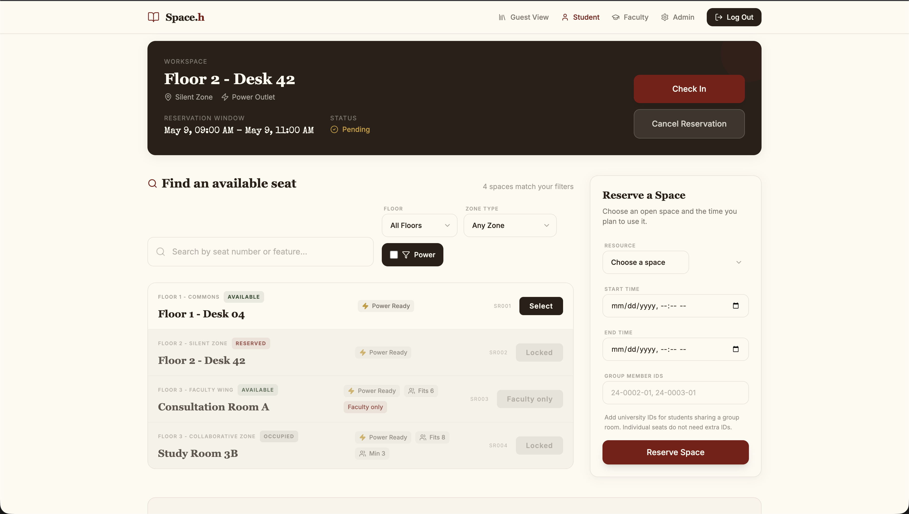

<h1 align="center">Space.h</h1>

<p align="center">
  <strong>A library reservation system for seats, rooms, consultations, and live resource operations.</strong>
</p>

<p align="center">
  
  
  
  
  
  
  
</p>

<p align="center">
  <a href="#product">Product</a> ·
  <a href="#features">Features</a> ·
  <a href="#local-development">Local Development</a> ·
  <a href="#production-deploy">Production Deploy</a>
</p>



## Product

Space.h is a full-stack reservation platform for university libraries. It helps guests, students, faculty, and library administrators understand space availability, reserve resources, and manage day-to-day usage from one interface.

The current experience focuses on a polished library workflow: students can find an available seat, review location and equipment details, book a time window, check in, and cancel when plans change. Admin and faculty flows support operational oversight and priority room usage.

## Features

- Public guest view for library availability and occupancy.
- Student reservations for individual seats and group rooms.
- Faculty-friendly consultation room flow.
- Admin dashboard for resources, reservations, attendance logs, and operational status.
- Authenticated API with role-based access.
- MySQL-backed persistence with first-run seed data for development and staging.
- Dockerized production stack for app, database, and private phpMyAdmin access.
- GitHub Actions for CI and security checks.
- Dependabot configuration for grouped dependency update pull requests.

## Stack

| Layer | Technology |
| --- | --- |
| Frontend | React 18, Vite 6, React Router, MUI, Radix UI |
| Backend | PHP 8.3, Apache, PDO MySQL |
| Database | MySQL 8.4 |
| Local services | Docker Compose, phpMyAdmin |
| Production | Docker Compose on Coolify with Traefik-managed HTTPS |
| CI/Security | GitHub Actions, npm audit, OSV Scanner, Gitleaks, Dependabot |

## Repository Layout

```txt
.
├── frontend/                  React + Vite client
├── backend/                   PHP API, Apache public entrypoint, schema
├── docs/                      Product, architecture, workflow notes, screenshots
├── Dockerfile                 Production app image
├── Dockerfile.mysql           MySQL image with schema initialization
├── docker-compose.yml         Local development stack
└── docker-compose.prod.yml    Coolify production stack
```

## Local Development

Start the local stack:

```bash
docker compose up --build
```

Local endpoints:

| Service | URL |
| --- | --- |
| Frontend dev server | `http://localhost:5173` |
| Apache app/API | `http://localhost:8080` |
| phpMyAdmin | `http://localhost:8081` |

Run frontend checks:

```bash
cd frontend
npm ci
npm run build
npm audit --audit-level=high
```

Run backend checks:

```bash
cd backend
find . -name '*.php' -print0 | xargs -0 -n1 php -l
php tests/run.php
```

## Production Deploy

Production is designed for Coolify using `docker-compose.prod.yml`.

Required Coolify settings:

```txt
Build Pack: Docker Compose
Base Directory: /
Docker Compose Location: /docker-compose.prod.yml
Domain for app: https://space-h.cedrake.dev
Domain for phpmyadmin: leave blank
```

Required environment variables:

```txt
SPACEH_DB_PASSWORD=<strong database user password>
SPACEH_DB_ROOT_PASSWORD=<strong root database password>
SPACEH_JWT_SECRET=<long random secret>
SPACEH_PUBLIC_URL=https://space-h.cedrake.dev
```

The production compose stack runs:

- `app`: Apache + PHP backend with the built React frontend.
- `mysql`: private MySQL database with schema loaded on first initialization.
- `phpmyadmin`: bound to `127.0.0.1:8081` on the server, not exposed publicly.

Access private phpMyAdmin through an SSH or Tailscale tunnel:

```bash
ssh -L 8081:127.0.0.1:8081 root@<server-tailscale-ip>
```

Then open:

```txt
http://127.0.0.1:8081
```

## Health Check

After deploy:

```txt
https://space-h.cedrake.dev/api/public/health
```

Expected response:

```json
{
  "service": "spaceh-backend",
  "status": "UP"
}
```

## Documentation

More project notes live in `docs/`:

- `docs/overview.md`
- `docs/architecture/domain-model.md`
- `docs/architecture/monorepo.md`
- `docs/development-workflow.md`
- `docs/guides/ci-and-security.md`
