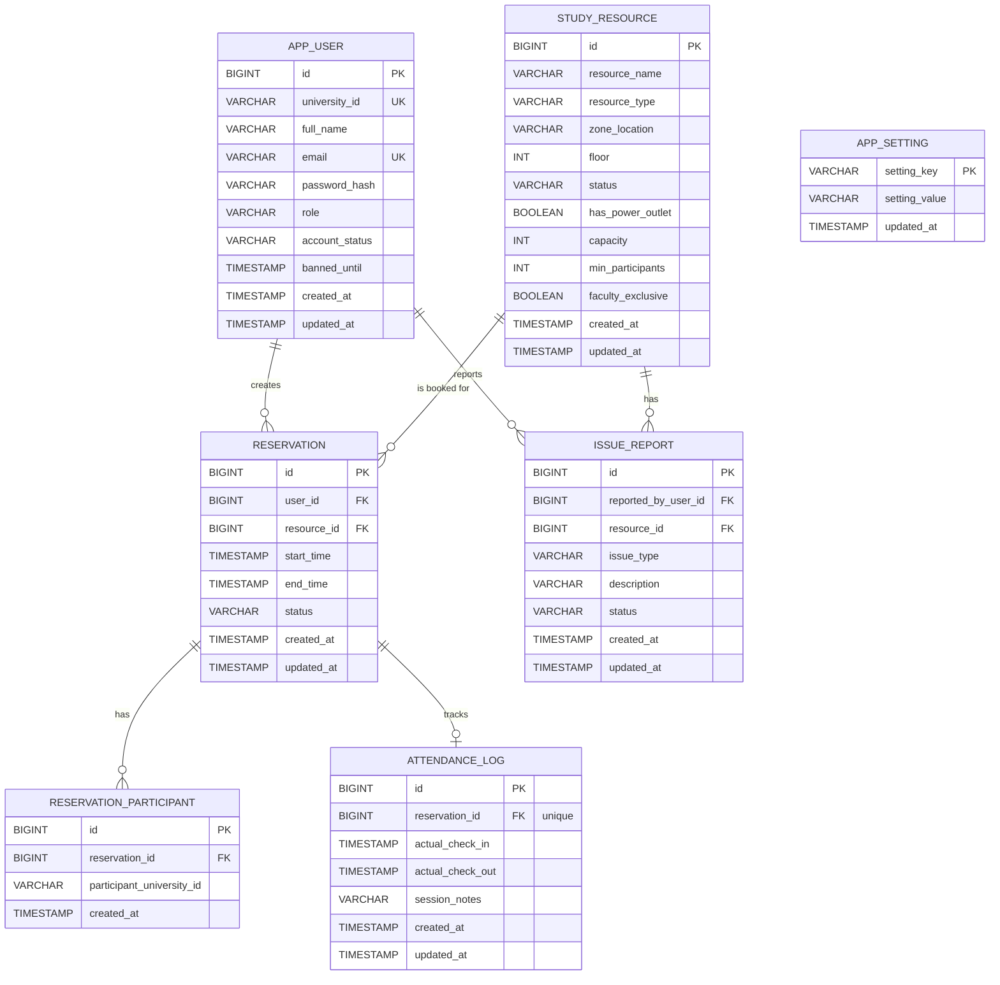

# Domain Model

The MySQL schema in `backend/schema/mysql.sql` establishes the backend tables that map to the app plan.

## Tables

- `app_user`
  - authenticated student, faculty, and admin accounts in a flat role-based model
- `study_resource`
  - library seats, study rooms, consultation rooms, status, capacity, participant minimums, and faculty-only flags
- `reservation`
  - booking records for seats and rooms, including pending, active, completed, cancelled, and no-show states
- `reservation_participant`
  - additional student IDs attached to a group booking
- `attendance_log`
  - check-in and check-out tracking for a reservation
- `issue_report`
  - broken desk reports and occupied-but-empty reports
- `app_setting`
  - key/value operational settings such as library opening and closing times

## Why Keep Schema In Code

Committed SQL keeps schema changes versioned and repeatable.

That matters because:

- local environments need the same database shape
- CI needs a predictable schema
- future changes must be additive and reviewable
- database evolution should be committed like code, not applied manually

## Relationship Summary

- one `app_user` creates many `reservation` rows
- one `study_resource` can be referenced by many `reservation` rows over time
- one `reservation` can have many `reservation_participant` rows
- one `reservation` can have one `attendance_log`
- one `app_user` can create many `issue_report` rows
- one `study_resource` can have many `issue_report` rows
- `app_setting` stores global settings and does not link to another table

## Mermaid ERD

## Current Business Rules

- User role is stored on `app_user.role`; there are no student, faculty, admin, or guest subtype tables.
- Library hours live in `app_setting` under `library_open_time` and `library_close_time`; defaults are `08:00` and `20:00`.
- Reservation windows must start in the future, stay within 30 days, stay on one local date, align to 30-minute slots, and fit inside library hours.
- Individual seats can be booked for at most 4 hours.
- Active reservation conflicts use `PENDING`, `CONFIRMED`, and `ACTIVE` statuses.
- Reservations that miss the 15-minute check-in grace period become `NO_SHOW`, and reserved resources are released.
- Maintenance-like statuses are treated as unavailable for booking and check-in.
